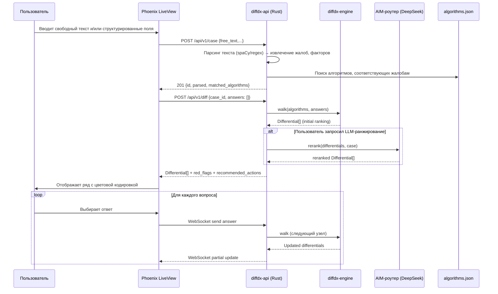

# DESIGN.md — Архитектурный план реализации подпроекта AIM/DiffDiagnosis

## 1. Слои

Система разделена на пять функциональных слоёв, каждый из которых реализован в отдельной директории или крейте.

| Слой | Компонент | Технология | Назначение |
|------|-----------|------------|------------|
| **data** | `sources/*.md` → `algorithms.json` | Python (spaCy, regex) + скрипты парсинга | Преобразование структурированных markdown-файлов канонических источников (Виноградов, Taylor) в единую JSON-схему алгоритмов |
| **engine** | `diffdx-engine` | Rust (крейт) | Детерминированный walker по `algorithms.json`; вычисляет дифференциальный ряд на основе ответов пользователя |
| **api** | `diffdx-api` | Rust (axum, serde, tokio-tungstenite) | REST + WebSocket сервер; принимает кейс, вызывает engine, проксирует LLM, возвращает результаты |
| **llm-glue** | `aim_llm_proxy` | Python (AIM роутер) или Rust HTTP-клиент | Асинхронный вызов DeepSeek через AIM-роутер; возвращает ранжирование дифференциалов, интерпретацию свободного текста, генерацию отчётов |
| **ui** | `Phoenix LiveView` | Elixir/Phoenix, Surface (опционально) | Клиентский веб-интерфейс: форма ввода кейса, live-дифференциал, просмотр алгоритмов и источников, экспорт отчётов |

### Схема взаимодействия (Mermaid)

```mermaid
flowchart TD
    subgraph Frontend [Phoenix LiveView UI]
        A[Ввод кейса / свободный текст] --> B[POST /api/v1/case]
        B --> C[POST /api/v1/diff]
    end

    subgraph Backend [Rust + Axum]
        B --> D[api: parse_case()]
        C --> E[api: diff_handler()]
        D --> F[entity: Case]
        E --> F
        F --> G[engine: walk()]
        G --> H{Rerank needed?}
        H -->|Yes| I[llm-glue: rerank(differentials, case)]
        H -->|No| J[return Differential[]]
        I --> J
    end

    subgraph LLM
        I --> K[DeepSeek через AIM-роутер]
        K --> I
    end

    subgraph Data
        L[algorithms.json<br/>sources/*.md] --> G
        L --> M[GET /api/v1/sources]
        M --> A
    end

    B2[WebSocket /ws/case/{id}] <--> N[api: ws_handler]
    N --> O[LLM reasoning stream]
    O --> B2
```

## 2. Контракт REST API

### 2.1. POST /api/v1/case — приём кейса

**Request:**
```json
{
  "id": "uuid (опционально, генерируется сервером)",
  "free_text": "Пациент 55 лет, жалуется на боль в груди...",
  "structured": {
    "presenting_complaints": ["chest_pain", "dyspnea"],
    "age": 55,
    "gender": "male",
    "risk_factors": ["smoking", "hypertension"],
    "duration": "acute"
  },
  "preferred_system": "vinogradov" // или "taylor", "both"
}
```

**Response (201):**
```json
{
  "id": "generated-uuid",
  "parsed": {
    "presenting_complaints": ["chest_pain"],
    "algorithms_matched": [
      {"id": "vinogradov.chest_pain.angina_vs_mi", "score": 0.95}
    ]
  }
}
```

### 2.2. POST /api/v1/diff — получение дифференциального ряда

**Request:**
```json
{
  "case_id": "uuid",
  "answers": [
    {"node_id": "q1", "answer": "yes"},
    {"node_id": "q2", "answer": "no"}
  ],
  "language": "ru"
}
```

**Response (200):**
```json
{
  "differentials": [
    {
      "name": "Инфаркт миокарда",
      "system_name": "vinogradov",
      "probability_class": "red_flag",
      "specificity": "high",
      "source": "vinogradov_01_chest_pain.md",
      "justification": "Тест 1 положительный, боль >30 минут..."
    },
    {
      "name": "Стабильная стенокардия",
      "probability_class": "common",
      "specificity": "medium",
      "justification": "...
    }
  ],
  "red_flags": [
    "Боль сохраняется >20 минут, не купируется нитроглицерином"
  ],
  "recommended_actions": [
    {"action": "ЭКГ", "priority": 1},
    {"action": "Тропонин", "priority": 2}
  ]
}
```

### 2.3. GET /api/v1/algorithm/{id} — получение дерева алгоритма

**Response (200):**
```json
{
  "id": "vinogradov.chest_pain.angina_vs_mi",
  "source": "vinogradov_01_chest_pain.md",
  "system": "vinogradov",
  "presenting_complaint": "chest_pain",
  "nodes": [
    {
      "id": "q1",
      "question": "Боль длится более 20 минут?",
      "branches": [
        {"answer": "yes", "next": "q2"},
        {"answer": "no", "conclusion": "angina_stable"}
      ]
    },
    {
      "id": "q2",
      "question": "Боль сопровождается холодным потом, страхом смерти?",
      "branches": [
        {"answer": "yes", "conclusion": "mi"},
        {"answer": "no", "next": "q3"}
      ]
    }
  ],
  "differentials": [
    {"name": "Инфаркт миокарда", "probability_class": "red_flag", "triggers": ["mi"]},
    {"name": "Нестабильная стенокардия", "probability_class": "red_flag", "triggers": ["unstable_angina"]},
    {"name": "Стабильная стенокардия", "probability_class": "common"}
  ],
  "red_flags": ["Боль >20 мин", "Холодный пот", "Одышка"]
}
```

### 2.4. GET /api/v1/sources — список разделов канона

**Response (200):**
```json
{
  "sources": [
    {"id": "vinogradov_01_chest_pain", "title": "Chest Pain", "system": "vinogradov"},
    {"id": "vinogradov_02_dyspnea_cough_hemoptysis", "title": "Dyspnea, Cough, Hemoptysis", "system": "vinogradov"},
    {"id": "taylor_01_cardiovascular", "title": "Cardiovascular", "system": "taylor"}
  ]
}
```

### 2.5. WebSocket /ws/case/{id} — стриминг reasoning шагов

**Сообщения (server → client):**
- `{"type": "searching", "algorithm": "vinogradov.chest_pain.angina_vs_mi"}`
- `{"type": "question", "node_id": "q1", "question": "Боль длится более 20 минут?"}`
- `{"type": "reasoning_step", "step": "...", "source": "LLM"}`
- `{"type": "partial_result", "differentials": [...]}`

## 3. Схема algorithms.json (JSON Schema)

Файл `algorithms.json` — единая база алгоритмов, извлечённых из всех `sources/*.md`. База обновляется скриптом `bin/parse_sources.py`. Схема описывает минимальный интерфейс, используемый `diffdx-engine`.

```json
{
  "$schema": "http://json-schema.org/draft-07/schema#",
  "title": "AIM DiffDiagnosis Algorithm",
  "type": "object",
  "required": ["id", "source", "system", "presenting_complaint", "nodes"],
  "properties": {
    "id": {
      "type": "string",
      "pattern": "^([a-z]+\\.)+[a-z_]+$",
      "description": "Уникальный идентификатор, например 'vinogradov.chest_pain.angina_vs_mi'"
    },
    "source": {
      "type": "string",
      "description": "Имя исходного markdown-файла, например 'vinogradov_01_chest_pain.md'"
    },
    "system": {
      "type": "string",
      "enum": ["vinogradov", "taylor"]
    },
    "presenting_complaint": {
      "type": "string",
      "description": "Ключевая жалоба/синдром, на который заточен алгоритм"
    },
    "nodes": {
      "type": "array",
      "items": {
        "type": "object",
        "required": ["id", "question", "branches"],
        "properties": {
          "id": { "type": "string" },
          "question": { "type": "string" },
          "branches": {
            "type": "array",
            "items": {
              "type": "object",
              "required": ["answer"],
              "properties": {
                "answer": { "type": "string" },
                "next": { "type": "string", "description": "ID следующего узла" },
                "conclusion": {
                  "type": "string",
                  "description": "Заключение (имя дифференциала), если ветка терминальная"
                }
              }
            }
          }
        }
      }
    },
    "differentials": {
      "type": "array",
      "items": {
        "type": "object",
        "required": ["name", "probability_class"],
        "properties": {
          "name": { "type": "string" },
          "probability_class": { "type": "string", "enum": ["common", "rare", "red_flag"] },
          "triggers": {
            "type": "array",
            "items": { "type": "string" },
            "description": "Список имён заключений (conclusion), которые активируют данный дифференциал"
          }
        }
      }
    },
    "red_flags": {
      "type": "array",
      "items": { "type": "string" },
      "description": "Перечень красных флагов для данного presenting complaint"
    }
  }
}
```

## 4. Phoenix LiveView UI

### 4.1. Страницы

| URL | Компонент | Описание |
|-----|-----------|----------|
| `/case` | `AimWeb.CaseLive.New` | Форма ввода кейса: текстовое поле для свободного текста, структурированные поля, выбор системы (Vinogradov/Taylor). |
| `/case/:id` | `AimWeb.CaseLive.Show` | Живой дифференциал: интерактивное дерево вопросов (алгоритм шагает), список дифференциалов с цветовой индикацией, кнопка «Ранжировать с помощью LLM». |
| `/algorithms` | `AimWeb.AlgorithmLive.Index` | Браузер алгоритмов: поиск по жалобе, фильтр по системе, отображение дерева. |
| `/sources` | `AimWeb.SourcesLive.Index` | Список разделов канона; можно открыть исходный markdown с подсветкой. |
| `/reports/:id` | `AimWeb.ReportLive.Show` | Экспорт отчёта: PDF (через WkHtmlToPdf или ExDoc) / HTML. |

### 4.2. Живой дифференциал (LiveView с WebSocket)

- При создании кейса открывается WebSocket `/ws/case/{id}`.
- Сервер отправляет первый вопрос алгоритма; LiveView рендерит его с вариантами ответа.
- После каждого ответа сервер возвращает обновлённый дифференциальный ряд.
- Когда алгоритм доходит до терминального узла, ряд фиксируется; можно запросить LLM-переранжирование.

### 4.3. Взаимодействие с backend

- `POST /api/v1/case` — создание кейса.
- `POST /api/v1/diff` — получение дифференциалов по ответам.
- WebSocket — для live-обновлений и стрима reasoning.

## 5. Поток данных



## 6. Безопасность и приватность

- **Никаких пациентских данных в логах.** Все `Case.id` — UUID. Поля `free_text` и `structured` не содержат персональной информации (ожидается, что пользователь вводит только клинические данные; при необходимости можно добавить фильтр на PII на уровне API).
- **Audit trail в SQLite.** Каждый запрос `POST /api/v1/case` и `POST /api/v1/diff` логируется в таблицу `audit_log` с меткой времени, типом запроса, идентификатором кейса и хешем (SHA-256) содержимого для проверки целостности. Логи хранятся не более 30 дней.
- **HTTPS** на уровне прокси (nginx/Caddy). API не требует аутентификации (открытая локальная сеть; в production добавить API-ключ).
- **LLM-запросы** не содержат PII; все кейсы перед отправкой в DeepSeek проходят анонимизацию (удаление имён, дат рождения, адресов).
- **CORS** настроен только для домена UI.

## 7. Тестирование

### 7.1. Unit-тесты (Rust)

- `cargo test` в крейте `diffdx-engine`:
  - Загрузка `algorithms.json` и валидация JSON Schema.
  - Обход каждого алгоритма со всеми возможными путями и проверка корректности заключений.
  - Золотые стандарты: 10–20 заранее размеченных кейсов из каждой книги (в виде `Case` → ожидаемый `Differential[]`).

### 7.2. Интеграционные тесты (Rust)

- `cargo test` в бинарнике `diffdx-api`:
  - Запуск axum-сервера на случайном порту.
  - Последовательность HTTP-запросов, моделирующая полный сценарий (create case → diff with answers → check differentials).

### 7.3. Тесты UI (Elixir)

- `mix test` — стандартные Phoenix тесты (контроллеры, LiveView, сокеты).
- `mix test.w